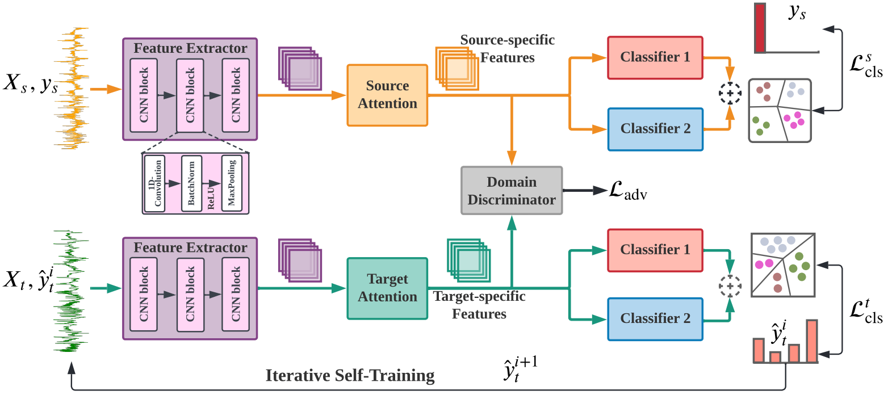

### [ADAST: Attentive Cross-domain EEG-based Sleep Staging Framework with Iterative Self-Training](https://arxiv.org/pdf/2107.04470.pdf) [[Cite](#citation)]
#### *by: Emadeldeen Eldele, Mohamed Ragab, Zhenghua Chen, Min Wu, Chee-Keong Kwoh, Xiaoli Li, and Cuntai Guan* 
#### This work has been accepted for publication in the [IEEE Transactions on Emerging Topics in Computational Intelligence (TETCI)](https://ieeexplore.ieee.org/document/9854170).    

<p align="center">

</p>


## Requirmenets:
- Python3.7
- Pytorch=='1.6'
- Numpy
- Sklearn
- Pandas
- openpyxl
- umap

## Prepare datasets
We used three public datasets in this study:
- [Sleep-EDF (EDF)](https://gist.github.com/emadeldeen24/a22691e36759934e53984289a94cb09b)
- [SHHS dataset (S1, S2)](https://sleepdata.org/datasets/shhs)

Data of each domain should be split into train/validate/test splits.
The domains IDs should be (a, b, c, ...). 

For example, the data files of domain 'a' should be 
`train_a.pt`, `val_a.pt`, and `test_a.pt`, such that `train_a.pt` is a dictionary.

`train_a.pt = {"samples": x-data, "labels: y-labels}`, and similarly `val_a.pt`, and `test_a.pt`.

## Training model 
You can update different hyperparameters in the model by updating `config_files/config.py` file.

To train the model, use this command:
```
python train_CD.py --experiment_description differentBatchSizes --run_description bs_128 --num_runs 1 --device cuda --plot_umap False
```
## Results
The results include the final classification report of the average performance and a seprate folder for each 
cross-domain scenario having its log file and its own classification report.

## Citation
IF you found this work useful for you, please consider citing it.
```
@article{emadeldeen_adast,
  author={Eldele, Emadeldeen and Ragab, Mohamed and Chen, Zhenghua and Wu, Min and Kwoh, Chee-Keong and Li, Xiaoli and Guan, Cuntai},
  journal={IEEE Transactions on Emerging Topics in Computational Intelligence}, 
  title={ADAST: Attentive Cross-Domain EEG-Based Sleep Staging Framework With Iterative Self-Training}, 
  year={2023},
  volume={7},
  number={1},
  pages={210-221},
  doi={10.1109/TETCI.2022.3189695
}
```


## Contact
Emadeldeen Eldele   
School of Computer Science and Engineering (SCSE)   
Nanyang Technological University, Singapore   
Email: emad0002{at}e.ntu.edu.sg   
