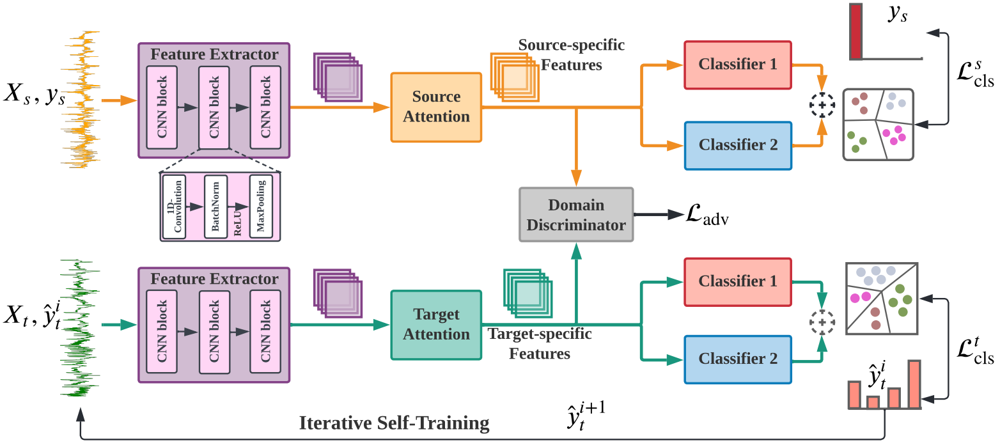

# ADAST
### [Adversarial Domain Adaptation with Self-Training for EEG-based Sleep Stage Classification](https://arxiv.org/pdf/2107.04470.pdf)
#### *by: Emadeldeen Eldele, Mohamed Ragab, Zhenghua Chen, Min Wu, Chee-Keong Kwoh, Xiaoli Li, and Cuntai Guan* 


## Abstract

Sleep staging is of great importance in the diagnosis and treatment of sleep disorders. Recently, numerous data driven deep learning models have been proposed for automatic sleep staging. They mainly train the model on a large public cohort labeled sleep dataset and test it on a smaller one with subjects of interest. However, they usually assume that the train and test data are drawn from the same distribution, which may not hold in real-world scenarios. Unsupervised domain adaption (UDA) has been recently developed to handle this domain shift problem. However, previous UDA methods applied for sleep staging has two main limitations. First, they rely on a totally shared model for the domain alignment, which may lose the domain-specific information during feature extraction. Second, they only align the source and target distributions globally without considering the class information in the target domain, which hinders the classification performance of the model while testing. In this work, we propose a novel adversarial learning framework called ADAST to tackle the domain shift problem in the unlabeled target domain. First, we develop unshared attention mechanism to preserve the domain-specific features in the source and target domains. Second, we design an iterative self-training strategy to align the fine-grained class distributions for the source and target domains via target domain pseudo labels. We also propose dual distinct classifiers to increase the robustness and quality of the pseudo labels. The experimental results on six cross-domain scenarios validate the efficacy of our proposed framework for sleep staging and its advantage over state-of-the-art UDA methods.

## Requirmenets:
- Python3.7
- Pytorch=='1.6'
- Numpy
- Sklearn
- Pandas
- openpyxl
- umap

## Prepare datasets
We used three public datasets in this study:
- [Sleep-EDF (EDF)](https://gist.github.com/emadeldeen24/a22691e36759934e53984289a94cb09b)
- [SHHS dataset (S1, S2)](https://sleepdata.org/datasets/shhs)

Data of each domain should be split into train/validate/test splits.
The domains IDs should be (a, b, c, ...). 

For example, the data files of domain 'a' should be 
`train_a.pt`, `val_a.pt`, and `test_a.pt`, such that `train_a.pt` is a dictionary.

`train_a.pt = {"samples": x-data, "labels: y-labels}`, and similarly `val_a.pt`, and `test_a.pt`.

## Training model 
You can update different hyperparameters in the model by updating `config_files/config.py` file.

To train the model, use this command:
```
python train_CD.py --experiment_description differentBatchSizes --run_description bs_128 --num_runs 1 --device cuda --plot_umap False
```
## Results
The results include the final classification report of the average performance and a seprate folder for each 
cross-domain scenario having its log file and its own classification report.

## Contact
Emadeldeen Eldele   
School of Computer Science and Engineering (SCSE)   
Nanyang Technological University, Singapore   
Email: emad0002{at}e.ntu.edu.sg   
